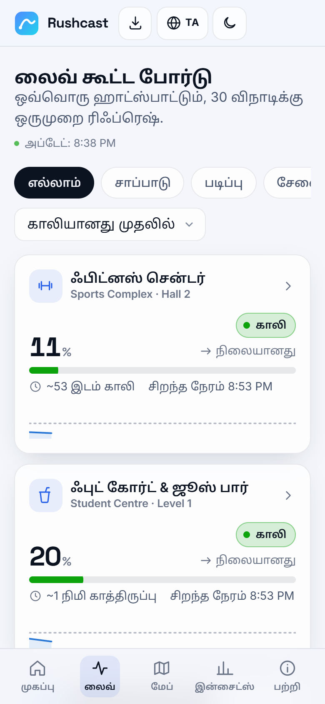
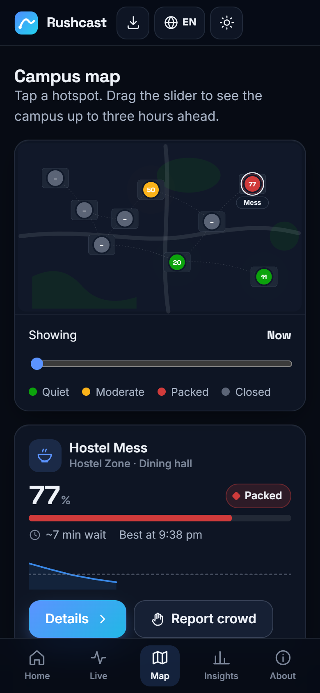
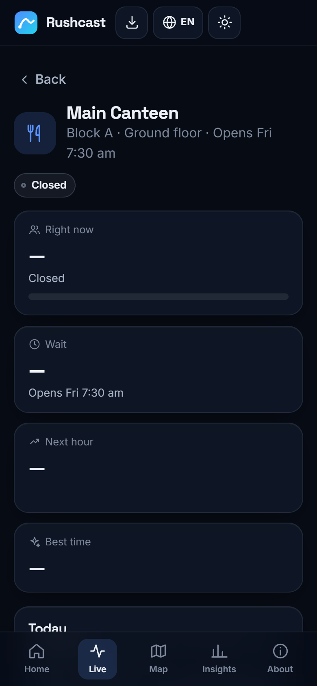

# Rushcast — Campus & Facility Crowd Predictor

**Know the rush before you walk.** Live crowd levels, wait times and 3-hour forecasts for the canteen, library, print shop and every campus hotspot.

**Live app:** https://andringodson.github.io/Hackathon-Ick-A-Thon/ · installable on Android, iOS and desktop (PWA)

Ick-a-thon 2026 · Round 1 · **Problem Statement 1 — Smart Queue & Rush Forecast System** · **Team Error404**

<p>
  
  
  
</p>

## The ick

Students and staff walk to the canteen, library or print shop between tight lecture slots, only to find it packed or closed. Long unpredictable waits, no seats, daily micro-stress — worst at lunch (12:30–2:00 PM) and right before submission deadlines.

## The fix

| What you get | How |
| --- | --- |
| **Live crowd level** (Quiet / Moderate / Packed) for every hotspot | Wi-Fi association counts blended with recency-weighted crowd reports |
| **Wait time or free seats** | Little's law over the estimated queue (`L·service_time/servers`), seats/spots for library, lab, gym |
| **3-hour nowcast** with an uncertainty band | Seasonal model + live deviation that decays over ~90 minutes |
| **Best time to go** and **rush alerts** | Scans the forecast for the quietest open slot and upcoming peaks |
| **Campus map with a time slider** | See the whole campus now or up to 3 hours ahead |
| **One-tap crowd reports** | Anonymous, rate-limited, realtime to everyone (mitigates Wi-Fi gaps) |
| **"Alert me when it's quiet"** | System notification through the service worker, one-shot |
| **Insights for vendors & admin** | Today's peaks, quietest windows, campus heatmap, model accuracy |
| **Six languages** | English, हिन्दी, தமிழ், മലയാളം, ಕನ್ನಡ, తెలుగు |

## Architecture

```
 Data layer                    Processing layer                    Presentation layer
 ───────────                   ────────────────                    ──────────────────
 Wi-Fi controller export  ──►  ingest/ (Python or Node)       ──►  Supabase Postgres  ──realtime──►  PWA (site/)
 (AP association counts)       5-min buckets, devices→people        readings, reports                 live board, map,
 One-tap crowd reports  ─────────────────────────────────────────►  (RLS + rate limit)                forecasts, alerts
                               pipeline/train.py (GitHub Actions, every 6 h)
                               seasonal profile + calendar effects + conformal band
                               ──► data/model.json (served with the app)
```

- **`pipeline/train.py`** (Python, NumPy) — recency-weighted weekday × 15-minute profile per facility, kernel-smoothed; multipliers for academic-calendar events (exam prep, submission deadlines) learned from history; split-conformal calibration so the p10–p90 band really covers ~80%. Backtested on the last two weeks every run against a naive "same slot last week" baseline.
- **`supabase/schema.sql`** (SQL, PL/pgSQL) — `reports` and `readings` tables, row-level security, server-side rate limiting trigger, device-ID-free public views, realtime publication, retention function.
- **`ingest/python`** and **`ingest/node`** — identical Wi-Fi ingest clients (CI asserts they agree row for row). Only aggregate counts leave the campus network: no MAC addresses, no users.
- **`site/`** (HTML, CSS, JavaScript ES modules, no build step) — the app: canvas flow-field background, View Transitions between routes, SVG charts, service worker, Web App Manifest.

### Current backtest (synthetic campus telemetry)

| Metric | Value |
| --- | --- |
| Mean absolute error | **7.4 occupancy points** |
| Naive baseline error | 10.3 points |
| Improvement | **~28%** |
| p10–p90 band coverage | **~80%** (target 80%) |

The deployed demo runs on realistic simulated Wi-Fi telemetry (timetable-driven peaks, deadline and exam weeks, device-per-person ratios, walkway leakage, noise), so it works anywhere. The model, metrics and app switch to real data automatically once readings arrive.

## Run it locally

```bash
python pipeline/train.py            # rebuild site/data/model.json (needs numpy)
cd site && python -m http.server 8000
# open http://localhost:8000
```

## Go live with a free database (Supabase, free forever plan)

Supabase's free plan is permanent (no card, no trial clock): 500 MB Postgres, realtime with 200 concurrent connections. Its one caveat — projects pause after 7 days without activity — is handled by the scheduled workflow, which calls the database every 6 hours.

1. Create a project at [supabase.com](https://supabase.com) → **SQL Editor** → paste [`supabase/schema.sql`](supabase/schema.sql) → **Run**.
2. In this repo: **Settings → Secrets and variables → Actions**
   - Variables: `SUPABASE_URL` (Project URL) and `SUPABASE_ANON_KEY` (anon public key — safe in the browser, RLS protects data)
   - Secret: `SUPABASE_SERVICE_KEY` (service-role key — server side only)
3. Re-run **Actions → Train model & deploy**. The header chip switches from *Demo data* to *Live data*.
4. Point the campus Wi-Fi controller export at the ingest client on a schedule:
   ```bash
   SUPABASE_URL=… SUPABASE_SERVICE_KEY=… python ingest/python/ingest_wifi.py --csv export.csv --ap-map ap-map.json
   # or: node ingest/node/ingest-wifi.mjs --csv export.csv --ap-map ap-map.json
   ```

## Feasibility & limitations

- **Wi-Fi counts are noisy** (devices per person vary, signals leak from corridors). Mitigation: headcount calibration per facility, plus crowd reports that self-correct the estimate in real time.
- **Missing telemetry** falls back to the model's typical curve with a lower confidence label, never a blank screen.
- **Privacy:** counts per building only; reports carry a random install ID that is never exposed back through the API.
- Scheduled workflows on public repos pause after 60 days without commits; any push re-enables them.

## Repo map

```
site/              the installable web app (GitHub Pages root)
  data/            facilities.json (catalogue + academic calendar), model.json (generated)
  assets/js/       app, engine (forecasting), store (Supabase/demo), charts, background, i18n
  assets/i18n/     en, hi, ta, ml, kn, te
pipeline/          train.py (model + backtest), make_icons.py
ingest/            Wi-Fi ingest clients (python/, node/) and samples/
supabase/          schema.sql
.github/workflows/ deploy.yml (train → test → deploy every push and every 6 h)
```

## Team Error404

_Add team member names, roll numbers and departments here._
